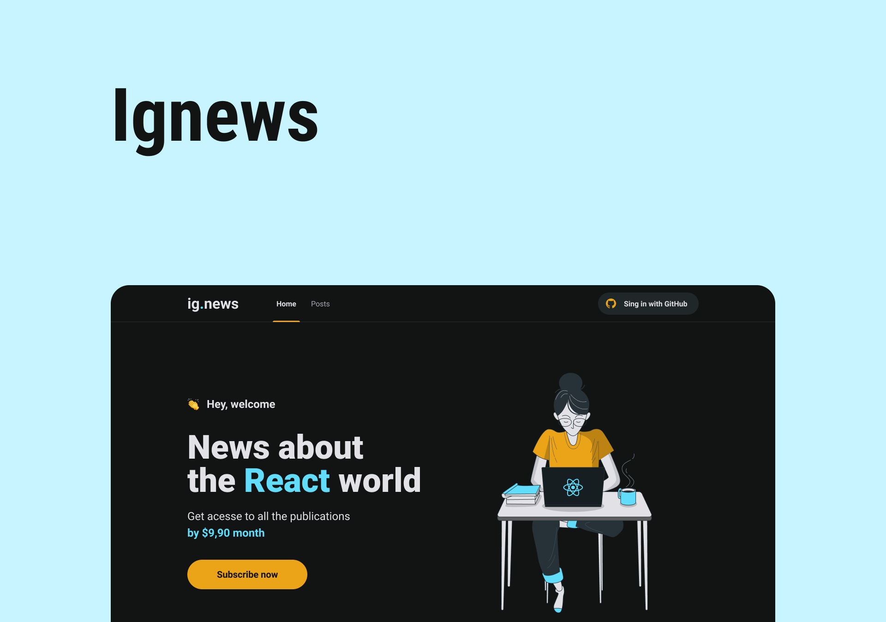

<h1 align="center">
  
</h1>

<h1 align="center">
  
</h1>

# Sobre o projeto

<p>
  Ignews é um blog sobre o universo de ReactJs, uma biblioteca para criação de interfaces do JavaScript. É possível fazer login através do Github e só é possível ler os conteúdos completos com uma inscrição ativa.
</p>

# Tecnologias

- [NextJs](https://nextjs.org/)
- [TypeScript](https://www.typescriptlang.org/)
- [Prismic CMS](https://prismic.io/)
- [Next Auth](https://next-auth.js.org/)
- [FaunaDB](https://fauna.com/)
- [Stripe](https://stripe.com/br)
- [Sass](https://sass-lang.com/)
- [React Icons](https://react-icons.github.io/react-icons/)
- [Jest](https://jestjs.io/pt-BR/)
- [Testing Library](https://testing-library.com/)

## Como baixar o projeto

```bash
# Clonar o repositório
$ git clone https://github.com/wellingtonrodriguesbr/ignews.git

# Entrar no diretório
$ cd ignews


# Instalar as dependências
$ yarn install

# Rodar o projeto
$ yarn dev
```

<br/>
<hr/>

<p align="center">Desenvolvido por <a href="https://www.linkedin.com/in/wellingtonrodriguesbr/" target="_blank">Wellington Rodrigues</a> ✌🏽</p>
